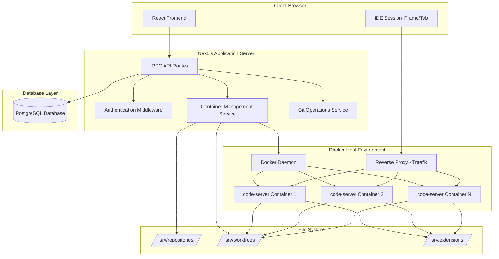
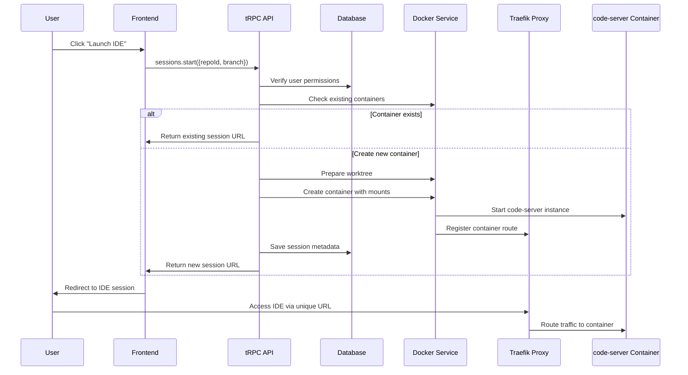

# Design Document

## Overview

The Cloud IDE Orchestrator is built as a Next.js application with tRPC for type-safe API communication, Drizzle ORM for database operations, and Docker for container orchestration. The system follows a microservices-inspired architecture where the main application acts as an orchestrator that dynamically manages isolated IDE containers.

The core architectural pattern is the **Orchestrator Model**: a central management application that spawns, manages, and routes traffic to individual code-server containers. Each container provides an isolated development environment for a specific user working on a specific repository branch.

## Architecture

### High-Level System Architecture



### Container Orchestration Flow



## Components and Interfaces

### Database Schema (Drizzle ORM)

```typescript
// Users table - extends existing auth pattern
export const users = createTable("user", (d) => ({
  id: d.integer().primaryKey().generatedByDefaultAsIdentity(),
  githubId: d.varchar({ length: 255 }).notNull().unique(),
  githubUsername: d.varchar({ length: 255 }).notNull(),
  email: d.varchar({ length: 255 }).notNull(),
  role: d.varchar({ length: 50 }).notNull().default('user'), // 'admin' | 'user'
  createdAt: d.timestamp({ withTimezone: true }).default(sql`CURRENT_TIMESTAMP`).notNull(),
  updatedAt: d.timestamp({ withTimezone: true }).$onUpdate(() => new Date()),
}));

// Repositories table
export const repositories = createTable("repository", (d) => ({
  id: d.integer().primaryKey().generatedByDefaultAsIdentity(),
  name: d.varchar({ length: 255 }).notNull(),
  gitUrl: d.varchar({ length: 500 }).notNull(),
  ownerId: d.integer().references(() => users.id).notNull(),
  deployKeyPublic: d.text(), // SSH public key for read access
  deployKeyPrivate: d.text(), // SSH private key for write access
  createdAt: d.timestamp({ withTimezone: true }).default(sql`CURRENT_TIMESTAMP`).notNull(),
  updatedAt: d.timestamp({ withTimezone: true }).$onUpdate(() => new Date()),
}));

// Permissions table - junction table with additional metadata
export const permissions = createTable("permission", (d) => ({
  id: d.integer().primaryKey().generatedByDefaultAsIdentity(),
  userId: d.integer().references(() => users.id).notNull(),
  repositoryId: d.integer().references(() => repositories.id).notNull(),
  canCreateBranches: d.boolean().notNull().default(false),
  branchLimit: d.integer().notNull().default(5),
  allowedBaseBranches: d.json().$type<string[]>().notNull().default(['main', 'develop']),
  allowTerminalAccess: d.boolean().notNull().default(true),
  createdAt: d.timestamp({ withTimezone: true }).default(sql`CURRENT_TIMESTAMP`).notNull(),
  updatedAt: d.timestamp({ withTimezone: true }).$onUpdate(() => new Date()),
}));

// IDE Sessions table - tracks active containers
export const ideSessions = createTable("ide_session", (d) => ({
  id: d.integer().primaryKey().generatedByDefaultAsIdentity(),
  userId: d.integer().references(() => users.id).notNull(),
  repositoryId: d.integer().references(() => repositories.id).notNull(),
  branchName: d.varchar({ length: 255 }).notNull(),
  containerId: d.varchar({ length: 255 }).notNull(),
  containerUrl: d.varchar({ length: 500 }).notNull(),
  status: d.varchar({ length: 50 }).notNull().default('running'), // 'running' | 'stopped' | 'error'
  lastAccessedAt: d.timestamp({ withTimezone: true }).default(sql`CURRENT_TIMESTAMP`).notNull(),
  createdAt: d.timestamp({ withTimezone: true }).default(sql`CURRENT_TIMESTAMP`).notNull(),
  updatedAt: d.timestamp({ withTimezone: true }).$onUpdate(() => new Date()),
}));

// Extensions table - global IDE extensions
export const extensions = createTable("extension", (d) => ({
  id: d.integer().primaryKey().generatedByDefaultAsIdentity(),
  extensionId: d.varchar({ length: 255 }).notNull().unique(), // e.g., 'ms-python.python'
  name: d.varchar({ length: 255 }).notNull(),
  version: d.varchar({ length: 50 }).notNull(),
  enabled: d.boolean().notNull().default(true),
  installedBy: d.integer().references(() => users.id).notNull(),
  createdAt: d.timestamp({ withTimezone: true }).default(sql`CURRENT_TIMESTAMP`).notNull(),
  updatedAt: d.timestamp({ withTimezone: true }).$onUpdate(() => new Date()),
}));
```

### tRPC API Routes

```typescript
// Authentication router
export const authRouter = createTRPCRouter({
  getSession: publicProcedure.query(({ ctx }) => {
    return ctx.session;
  }),
  
  githubCallback: publicProcedure
    .input(z.object({ code: z.string() }))
    .mutation(async ({ input, ctx }) => {
      // Handle GitHub OAuth callback
    }),
});

// Admin router - protected by admin middleware
export const adminRouter = createTRPCRouter({
  getUsers: adminProcedure.query(async ({ ctx }) => {
    return ctx.db.select().from(users);
  }),
  
  updateUserRole: adminProcedure
    .input(z.object({ userId: z.number(), role: z.enum(['admin', 'user']) }))
    .mutation(async ({ input, ctx }) => {
      // Update user role
    }),
  
  addRepository: adminProcedure
    .input(z.object({ name: z.string(), gitUrl: z.string() }))
    .mutation(async ({ input, ctx }) => {
      // Add new repository with deploy key generation
    }),
  
  managePermissions: adminProcedure
    .input(z.object({
      userId: z.number(),
      repositoryId: z.number(),
      permissions: z.object({
        canCreateBranches: z.boolean(),
        branchLimit: z.number(),
        allowedBaseBranches: z.array(z.string()),
        allowTerminalAccess: z.boolean(),
      })
    }))
    .mutation(async ({ input, ctx }) => {
      // Set user permissions for repository
    }),
  
  installExtension: adminProcedure
    .input(z.object({ extensionId: z.string() }))
    .mutation(async ({ input, ctx }) => {
      // Install VS Code extension globally
    }),
});

// User dashboard router
export const dashboardRouter = createTRPCRouter({
  getMyRepositories: protectedProcedure.query(async ({ ctx }) => {
    // Return repositories user has access to
  }),
  
  getRepositoryBranches: protectedProcedure
    .input(z.object({ repositoryId: z.number() }))
    .query(async ({ input, ctx }) => {
      // Fetch branches from Git repository
    }),
  
  createBranch: protectedProcedure
    .input(z.object({
      repositoryId: z.number(),
      branchName: z.string(),
      baseBranch: z.string(),
    }))
    .mutation(async ({ input, ctx }) => {
      // Create new branch with validation
    }),
});

// Session management router
export const sessionRouter = createTRPCRouter({
  start: protectedProcedure
    .input(z.object({
      repositoryId: z.number(),
      branchName: z.string(),
    }))
    .mutation(async ({ input, ctx }) => {
      // Main IDE launcher logic
    }),
  
  stop: protectedProcedure
    .input(z.object({ sessionId: z.number() }))
    .mutation(async ({ input, ctx }) => {
      // Stop IDE session and cleanup container
    }),
  
  getMySessions: protectedProcedure.query(async ({ ctx }) => {
    // Get user's active sessions
  }),
});
```

### Container Management Service

```typescript
interface ContainerManager {
  createIdeSession(params: {
    userId: number;
    repositoryId: number;
    branchName: string;
    permissions: UserPermissions;
  }): Promise<IdeSession>;
  
  stopSession(sessionId: number): Promise<void>;
  cleanupInactiveSessions(): Promise<void>;
  getSessionStatus(sessionId: number): Promise<SessionStatus>;
}

interface DockerService {
  createContainer(config: ContainerConfig): Promise<Container>;
  startContainer(containerId: string): Promise<void>;
  stopContainer(containerId: string): Promise<void>;
  removeContainer(containerId: string): Promise<void>;
  listContainers(): Promise<Container[]>;
}

interface GitService {
  cloneRepository(gitUrl: string, targetPath: string): Promise<void>;
  createWorktree(repoPath: string, branchName: string, worktreePath: string): Promise<void>;
  removeWorktree(worktreePath: string): Promise<void>;
  fetchBranches(repoPath: string): Promise<string[]>;
  createBranch(repoPath: string, branchName: string, baseBranch: string): Promise<void>;
}
```

## Data Models

### Core Domain Models

```typescript
interface User {
  id: number;
  githubId: string;
  githubUsername: string;
  email: string;
  role: 'admin' | 'user';
  createdAt: Date;
  updatedAt: Date;
}

interface Repository {
  id: number;
  name: string;
  gitUrl: string;
  ownerId: number;
  deployKeyPublic?: string;
  deployKeyPrivate?: string;
  createdAt: Date;
  updatedAt: Date;
}

interface Permission {
  id: number;
  userId: number;
  repositoryId: number;
  canCreateBranches: boolean;
  branchLimit: number;
  allowedBaseBranches: string[];
  allowTerminalAccess: boolean;
  createdAt: Date;
  updatedAt: Date;
}

interface IdeSession {
  id: number;
  userId: number;
  repositoryId: number;
  branchName: string;
  containerId: string;
  containerUrl: string;
  status: 'running' | 'stopped' | 'error';
  lastAccessedAt: Date;
  createdAt: Date;
  updatedAt: Date;
}

interface Extension {
  id: number;
  extensionId: string;
  name: string;
  version: string;
  enabled: boolean;
  installedBy: number;
  createdAt: Date;
  updatedAt: Date;
}
```

### Container Configuration

```typescript
interface ContainerConfig {
  image: string; // 'codercom/code-server:latest'
  name: string; // Unique container name
  mounts: Mount[];
  environment: Record<string, string>;
  labels: Record<string, string>; // Traefik routing labels
  resources: ResourceLimits;
  networkMode: string;
}

interface Mount {
  source: string; // Host path
  target: string; // Container path
  type: 'bind' | 'volume';
  readOnly?: boolean;
}

interface ResourceLimits {
  memory: string; // e.g., '2g'
  cpus: string; // e.g., '1.0'
}
```

## Error Handling

### Error Categories and Responses

```typescript
enum ErrorCode {
  UNAUTHORIZED = 'UNAUTHORIZED',
  FORBIDDEN = 'FORBIDDEN',
  REPOSITORY_NOT_FOUND = 'REPOSITORY_NOT_FOUND',
  BRANCH_NOT_FOUND = 'BRANCH_NOT_FOUND',
  CONTAINER_CREATION_FAILED = 'CONTAINER_CREATION_FAILED',
  GIT_OPERATION_FAILED = 'GIT_OPERATION_FAILED',
  RESOURCE_LIMIT_EXCEEDED = 'RESOURCE_LIMIT_EXCEEDED',
  SESSION_NOT_FOUND = 'SESSION_NOT_FOUND',
}

interface ApiError {
  code: ErrorCode;
  message: string;
  details?: Record<string, any>;
}
```

### Error Handling Strategy

1. **Authentication Errors**: Return 401 with redirect to login
2. **Authorization Errors**: Return 403 with clear permission requirements
3. **Resource Errors**: Return 404 with helpful suggestions
4. **Container Errors**: Log detailed information, return 500 with generic message
5. **Git Errors**: Log git output, return specific error based on git exit code
6. **Validation Errors**: Return 400 with field-specific error messages

### Logging and Monitoring

```typescript
interface LogEntry {
  timestamp: Date;
  level: 'info' | 'warn' | 'error' | 'debug';
  service: string;
  userId?: number;
  sessionId?: number;
  message: string;
  metadata?: Record<string, any>;
}

// Key metrics to track
interface Metrics {
  activeContainers: number;
  totalSessions: number;
  averageSessionDuration: number;
  resourceUtilization: {
    cpu: number;
    memory: number;
    disk: number;
  };
  errorRates: Record<ErrorCode, number>;
}
```

## Testing Strategy

### Unit Testing

- **Database Operations**: Test all Drizzle ORM queries and mutations
- **Business Logic**: Test permission validation, branch naming, resource limits
- **Container Management**: Mock Docker API calls, test container lifecycle
- **Git Operations**: Mock git commands, test worktree management
- **Authentication**: Test GitHub OAuth flow, session management

### Integration Testing

- **API Endpoints**: Test complete tRPC procedures with real database
- **Container Orchestration**: Test full IDE session creation and cleanup
- **File System Operations**: Test repository cloning and worktree creation
- **Reverse Proxy**: Test Traefik routing configuration

### End-to-End Testing

- **User Workflows**: Test complete user journeys from login to IDE access
- **Admin Workflows**: Test repository management and permission assignment
- **Security Boundaries**: Test isolation between users and repositories
- **Resource Management**: Test container limits and cleanup processes

### Testing Infrastructure

```typescript
// Test utilities
interface TestContext {
  db: Database;
  docker: MockDockerService;
  git: MockGitService;
  testUser: User;
  testRepository: Repository;
}

// Test data factories
class TestDataFactory {
  static createUser(overrides?: Partial<User>): User;
  static createRepository(overrides?: Partial<Repository>): Repository;
  static createPermission(overrides?: Partial<Permission>): Permission;
  static createIdeSession(overrides?: Partial<IdeSession>): IdeSession;
}
```

### Security Testing

- **Container Isolation**: Verify users cannot access other containers or host system
- **File System Isolation**: Verify users can only access their assigned worktree
- **Network Isolation**: Verify containers cannot access unauthorized services
- **Authentication Bypass**: Test for authentication and authorization vulnerabilities
- **Input Validation**: Test for injection attacks in all user inputs

This design provides a robust, scalable foundation for the Cloud IDE Orchestrator that leverages your existing Next.js/tRPC/Drizzle stack while adding the necessary container orchestration and security layers.